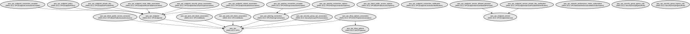

# AWS VPC Infrastructure Modules

A comprehensive collection of Terraform modules for managing AWS VPC networking infrastructure with granular control over VPC components and networking configurations.

This repository provides a modular approach to creating and managing AWS VPC resources, including VPCs, subnets, route tables, security groups, network ACLs, VPC endpoints, and more. The modules are designed to be flexible and reusable, allowing you to create complex networking architectures while maintaining infrastructure as code best practices.

Key features include:
- Modular VPC component creation with fine-grained control
- Support for IPv4 and IPv6 addressing
- Integration with AWS IPAM for CIDR management
- Comprehensive VPC endpoint configuration
- Advanced networking features like VPC peering, NAT gateways, and traffic mirroring
- Network security controls through security groups and NACLs
- DNS and DHCP options management

## Repository Structure
```
modules/
├── aws_default_route_table/       # Default route table configuration
├── aws_egress_only_igw/          # Egress-only internet gateway for IPv6
├── aws_internet_gateway/         # Internet gateway configuration
├── aws_nat_gateway/             # NAT gateway setup and configuration
├── aws_network_acl/             # Network ACL rules and associations
├── aws_network_module/          # Core network interface configurations
├── aws_route_table_*/           # Route table configurations (public/private)
├── aws_security_group_rule/     # Security group rule definitions
├── aws_subnet/                  # Subnet creation and configuration
├── aws_vpc/                     # Main VPC resource configuration
├── aws_vpc_security_groups/     # VPC security group management
├── ec2_networking/             # EC2-specific network configurations
├── flow-logs/                  # VPC flow logs configuration
├── vpc_core/                   # Core VPC infrastructure
├── vpc_endpoint*/              # VPC endpoint configurations
└── vpc_peering*/              # VPC peering connection setup
```

## Usage Instructions
### Prerequisites
- Terraform >= 1.5.7
- AWS Provider >= 5.94.1
- AWS CLI configured with appropriate credentials
- IAM permissions to create and manage VPC resources

### Installation
1. Clone the repository:
```bash
git clone <repository-url>
cd aws-vpc-modules
```

2. Initialize Terraform:
```bash
terraform init
```

### Quick Start
1. Create a basic VPC configuration:
```hcl
module "vpc" {
  source = "./modules/vpc_core"
  
  create_vpc = true
  vpc = [{
    name = "my-vpc"
    ipv4_cidr = "10.0.0.0/16"
    enable_dns_hostnames = true
    enable_dns_support = true
  }]
  
  tags = {
    Environment = "production"
  }
}
```

### More Detailed Examples
1. Creating a VPC with public and private subnets:
```hcl
module "vpc" {
  source = "./modules/aws_vpc"
  
  name = "my-vpc"
  cidr_block = "10.0.0.0/16"
  enable_dns_support = true
  enable_dns_hostnames = true
  
  tags = {
    Environment = "production"
  }
}

module "subnets" {
  source = "./modules/aws_subnet"
  
  vpc_id = module.vpc.vpc_id
  
  public_subnets = [
    {
      cidr_block = "10.0.1.0/24"
      availability_zone = "us-west-2a"
    }
  ]
  
  private_subnets = [
    {
      cidr_block = "10.0.2.0/24"
      availability_zone = "us-west-2a"
    }
  ]
}
```

### Troubleshooting
Common issues and solutions:

1. CIDR Block Conflicts
```
Error: The CIDR block is already in use
```
- Verify that the CIDR block isn't already allocated in your VPC
- Check for overlapping CIDR ranges in peered VPCs
- Use `aws ec2 describe-vpcs` to list existing VPC CIDR blocks

2. Route Table Association Failures
```
Error: Route table association not found
```
- Ensure the subnet exists and is in the correct VPC
- Verify that the route table ID is correct
- Check IAM permissions for route table operations

3. VPC Endpoint Creation Issues
- Enable DNS hostnames and DNS support in the VPC
- Verify service name format (e.g., com.amazonaws.region.service)
- Check security group and subnet configurations

## Data Flow
The VPC modules manage network infrastructure through a layered approach, starting with core VPC creation and extending to specific networking components.

```ascii
[VPC Core] --> [Subnets] --> [Route Tables] --> [Internet/NAT Gateways]
     |             |              |                    |
     v             v              v                    v
[Security Groups]-->[NACLs]--->[VPC Endpoints]-->[VPC Peering]
```

Component interactions:
1. VPC Core creates the base network infrastructure
2. Subnets segment the network into public and private areas
3. Route tables direct traffic between subnets and to/from the internet
4. Security groups and NACLs provide network security at instance and subnet levels
5. VPC endpoints enable private connectivity to AWS services
6. VPC peering enables communication between VPCs
7. NAT gateways provide internet access for private subnets
8. Flow logs capture network traffic for monitoring and analysis

## Infrastructure


The modules create and manage the following AWS resources:

Lambda:
- VPC Flow Log processors for network traffic analysis

Network:
- VPCs with customizable CIDR blocks
- Public and private subnets across availability zones
- Internet and NAT gateways
- Route tables and associations
- Network ACLs and security groups
- VPC endpoints for AWS services
- VPC peering connections

Monitoring:
- VPC Flow Logs
- Network performance metrics
- Traffic mirroring configurations