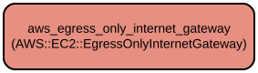

# AWS Egress-Only Internet Gateway Terraform Module for IPv6-Enabled VPCs

This Terraform module creates and manages an AWS Egress-Only Internet Gateway (EIGW) for IPv6-enabled VPCs. It provides a secure way to allow IPv6 traffic to flow from private subnets to the internet while preventing inbound access, similar to how NAT Gateways work for IPv4 traffic.

The module implements conditional creation logic that ensures the EIGW is only provisioned when necessary, based on VPC configuration and IPv6 requirements. It supports custom tagging capabilities and integrates seamlessly with existing VPC infrastructure through variable-driven configuration.

## Repository Structure
```
modules/aws_egress_only_igw/
├── main.tf           # Core resource definitions and creation logic for the EIGW
├── outputs.tf        # Defines the EIGW ID output for reference by other resources
├── variables.tf      # Input variable definitions for module configuration
└── versions.tf       # Terraform and provider version constraints
```

## Usage Instructions

### Prerequisites
- Terraform >= 1.5.7
- AWS Provider >= 5.94.1
- AWS account with appropriate permissions
- Existing VPC with IPv6 CIDR block assigned
- One or more private subnets

### Installation

1. Add the module to your Terraform configuration:

```hcl
module "egress_only_igw" {
  source = "path/to/modules/aws_egress_only_igw"

  create_vpc            = true
  create_egress_only_igw = true
  enable_ipv6          = true
  vpc_id               = "vpc-12345678"
  private_subnets      = ["subnet-12345678", "subnet-87654321"]
  
  egress_only_igw_tags = {
    Environment = "Production"
  }
  
  general_tags = {
    Project = "MyProject"
    Owner   = "Infrastructure Team"
  }
}
```

### Quick Start

1. Initialize your Terraform working directory:
```bash
terraform init
```

2. Review the planned changes:
```bash
terraform plan
```

3. Apply the configuration:
```bash
terraform get
terraform apply
```

### More Detailed Examples

Creating an EIGW with custom tags and multiple private subnets:

```hcl
module "egress_only_igw" {
  source = "path/to/modules/aws_egress_only_igw"

  create_vpc            = true
  create_egress_only_igw = true
  enable_ipv6          = true
  vpc_id               = aws_vpc.main.id
  private_subnets      = aws_subnet.private[*].id
  
  egress_only_igw_tags = {
    Environment = "Production"
    Purpose     = "IPv6-Egress"
  }
  
  general_tags = {
    Project     = "MyProject"
    Owner       = "Infrastructure Team"
    Terraform   = "true"
  }
}
```

### Troubleshooting

Common issues and solutions:

1. EIGW not being created
   - Verify that `enable_ipv6` is set to `true`
   - Confirm that `private_subnets` contains at least one subnet
   - Check that `create_vpc` and `create_egress_only_igw` are both `true`

2. IPv6 connectivity issues
   - Ensure your VPC has an IPv6 CIDR block assigned
   - Verify route tables are properly configured with ::/0 pointing to the EIGW
   - Check security groups allow IPv6 traffic

Debug mode can be enabled by setting the following environment variable:
```bash
export TF_LOG=DEBUG
```

Log files location:
```bash
export TF_LOG_PATH=./terraform.log
```

## Data Flow

The module evaluates input conditions to determine if an EIGW should be created and attaches it to the specified VPC for IPv6 egress traffic.

```ascii
Input Variables ──> Conditional Logic ──> EIGW Creation ──> VPC Attachment
     │                    │                    │                 │
     │                    │                    │                 │
     └─────────────┬──────────────────────────┴─────────────────┘
                   │
              Output EIGW ID
```

Component interactions:
1. Module receives input variables including VPC ID and subnet information
2. Evaluates creation conditions through local variables
3. Creates EIGW if all conditions are met (IPv6 enabled, private subnets exist)
4. Attaches EIGW to specified VPC
5. Applies provided tags to the EIGW resource
6. Outputs the EIGW ID for reference by other resources

## Infrastructure



AWS Resources created by this module:

**Egress Only Internet Gateway**
- Type: `aws_egress_only_internet_gateway`
- Purpose: Enables outbound IPv6 traffic from private subnets while preventing inbound access
- Creation Conditions:
  - VPC creation is enabled
  - EIGW creation is enabled
  - IPv6 is enabled
  - At least one private subnet exists