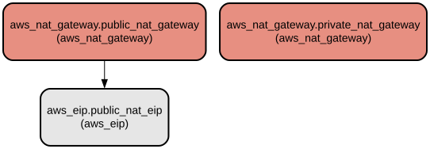

# AWS NAT Gateway Terraform Module - Flexible NAT Gateway Provisioning for AWS VPCs

This Terraform module provides a flexible and configurable solution for deploying both public and private NAT Gateways in AWS VPCs. 
It enables fine-grained control over NAT Gateway deployment with support for custom IP assignments, resource tagging, and efficient resource allocation.

The module offers comprehensive NAT Gateway management capabilities including:
- Configurable deployment of public and private NAT Gateways
- Support for single or multiple NAT Gateway deployments across subnets
- Custom private IP address assignment
- Elastic IP management with options to reuse existing EIPs
- Extensive tagging support for resource organization
- Flexible subnet association for both public and private NAT Gateways

## Repository Structure
```
modules/aws_nat_gateway/
├── main.tf           # Core NAT Gateway resource definitions and logic
├── outputs.tf        # Output definitions for NAT Gateway IDs and IPs
├── variables.tf      # Input variable definitions for module configuration
└── versions.tf       # Terraform and provider version constraints
```

## Usage Instructions
### Prerequisites
- Terraform >= 1.5.7
- AWS Provider >= 5.94.1
- AWS CLI configured with appropriate credentials
- Existing VPC with public and private subnets

### Installation
1. Add the module to your Terraform configuration:
```hcl
module "nat_gateway" {
  source = "path/to/modules/aws_nat_gateway"

  create_vpc                    = true
  enable_public_nat_gateway    = true
  enable_private_nat_gateway   = false
  single_public_nat_gateway    = true
  public_subnets              = ["subnet-1234567890"]
  private_subnets             = ["subnet-0987654321"]
  
  public_nat_gateway_tags     = {
    Environment = "Production"
  }
  general_tags                = {
    Project = "MyProject"
  }
}
```

2. Initialize Terraform:
```bash
terraform init
```

3. Apply the configuration:
```bash
terraform plan
terraform apply
```

### Quick Start
Basic deployment of a single public NAT Gateway:
```hcl
module "nat_gateway" {
  source = "path/to/modules/aws_nat_gateway"

  create_vpc                 = true
  enable_public_nat_gateway = true
  single_public_nat_gateway = true
  public_subnets           = ["subnet-1234567890"]
  
  public_nat_gateway_tags  = {
    Name = "main-nat-gateway"
  }
  general_tags             = {
    Environment = "Production"
  }
}
```

### More Detailed Examples
1. Deploy multiple public NAT Gateways with custom private IPs:
```hcl
module "nat_gateway" {
  source = "path/to/modules/aws_nat_gateway"

  create_vpc                              = true
  enable_public_nat_gateway              = true
  single_public_nat_gateway              = false
  assign_custom_privateIP_to_public_nat_gw = true
  public_nat_gw_private_ip              = ["10.0.1.10", "10.0.2.10"]
  public_subnets                        = ["subnet-1", "subnet-2"]
}
```

2. Deploy private NAT Gateway with existing EIPs:
```hcl
module "nat_gateway" {
  source = "path/to/modules/aws_nat_gateway"

  create_vpc                 = true
  enable_private_nat_gateway = true
  reuse_public_nat_eips     = true
  external_public_nat_eips  = ["eip-12345"]
  private_subnets          = ["subnet-private1"]
}
```

### Troubleshooting
Common issues and solutions:

1. EIP Allocation Failure
```
Error: Error creating EIP: AddressLimitExceeded
```
Solution: Check your AWS account's EIP limit and request an increase if needed:
```bash
aws service-quotas request-service-quota-increase \
    --quota-code L-0263D0A3 \
    --service-code ec2 \
    --desired-value 10
```

2. NAT Gateway Creation Timeout
```
Error: Error creating NAT Gateway: Gateway.NotAttached
```
Solution: Ensure the specified subnet exists and has internet connectivity:
```bash
aws ec2 describe-subnets --subnet-ids subnet-1234567890
```

## Data Flow
The module manages NAT Gateway provisioning through a structured workflow that handles resource creation and configuration.

```ascii
                                    ┌─────────────────┐
                                    │  Input Variables│
                                    └────────┬────────┘
                                            │
                                            ▼
┌─────────────────┐              ┌─────────────────────┐
│  Existing EIPs  │──────────────►  EIP Allocation    │
└─────────────────┘              └─────────┬───────────┘
                                          │
                                          ▼
┌─────────────────┐              ┌─────────────────────┐
│ Public Subnets  │──────────────►  NAT Gateway       │
└─────────────────┘              │  Creation          │
                                 └─────────┬───────────┘
                                          │
                                          ▼
                                 ┌─────────────────────┐
                                 │  Output Values      │
                                 └─────────────────────┘
```

Key component interactions:
1. Variable validation and local value computation
2. Conditional EIP allocation based on configuration
3. NAT Gateway creation with subnet association
4. Tag application to all created resources
5. Output generation for created resources

## Infrastructure


The module creates the following AWS resources:

### Elastic IP (EIP)
- Type: `aws_eip`
- Purpose: Allocates Elastic IPs for public NAT Gateways
- Created when: `reuse_public_nat_eips = false`

### NAT Gateway
- Type: `aws_nat_gateway`
- Variants:
  - Public NAT Gateway: Internet-facing NAT with EIP
  - Private NAT Gateway: Internal NAT without EIP
- Configuration: Supports custom private IPs and tagging