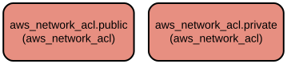

# AWS Network ACL Terraform Module: Simplified Network Access Control Management

This Terraform module provides a streamlined way to create and manage Network Access Control Lists (NACLs) for AWS VPC subnets. It enables fine-grained control over inbound and outbound traffic for both public and private subnets through dedicated network ACLs, with support for IPv4 and IPv6 rules.

The module implements a flexible and maintainable approach to network security by allowing separate rule sets for public and private subnets. It supports comprehensive network access control with customizable ingress and egress rules, protocol specifications, and port ranges. The module also includes tagging capabilities for better resource management and organization.

## Repository Structure
```
modules/aws_network_acl/
├── main.tf           # Core logic for creating public and private NACLs
├── variables.tf      # Input variable definitions for NACL configuration
├── outputs.tf        # Output definitions for NACL IDs
└── versions.tf       # Terraform and provider version constraints
```

## Usage Instructions
### Prerequisites
- Terraform >= 1.5.7
- AWS Provider >= 5.94.1
- AWS CLI configured with appropriate credentials
- Existing VPC and subnets in AWS

### Installation
1. Add the module to your Terraform configuration:

```hcl
module "network_acl" {
  source = "path/to/modules/aws_network_acl"

  vpc_id = "vpc-12345678"
  create_vpc = true
  
  public_dedicated_network_acl = true
  private_dedicated_network_acl = true
  
  public_subnets = ["subnet-1234", "subnet-5678"]
  private_subnets = ["subnet-abcd", "subnet-efgh"]
  
  # Define NACL rules
  public_network_acl_ingress = [
    {
      rule_no    = 100
      action     = "allow"
      from_port  = 80
      to_port    = 80
      protocol   = "tcp"
      cidr_block = "0.0.0.0/0"
    }
  ]
  
  # Add tags
  public_acl_tags = {
    Environment = "Production"
  }
  private_acl_tags = {
    Environment = "Production"
  }
  general_tags = {
    Project = "MyProject"
  }
}
```

### Quick Start
1. Create a new Terraform configuration file (e.g., `main.tf`)
2. Copy the module usage example above
3. Customize the variables according to your requirements
4. Initialize Terraform:
```bash
terraform init
```
5. Review the planned changes:
```bash
terraform plan
```
6. Apply the configuration:
```bash
terraform get
terraform apply
```

### More Detailed Examples

#### Creating Public NACL with HTTP/HTTPS Access
```hcl
public_network_acl_ingress = [
  {
    rule_no    = 100
    action     = "allow"
    from_port  = 80
    to_port    = 80
    protocol   = "tcp"
    cidr_block = "0.0.0.0/0"
  },
  {
    rule_no    = 110
    action     = "allow"
    from_port  = 443
    to_port    = 443
    protocol   = "tcp"
    cidr_block = "0.0.0.0/0"
  }
]
```

### Troubleshooting

#### Common Issues

1. **NACL Not Applying to Subnets**
   - Problem: NACLs are created but not associated with subnets
   - Solution: Verify subnet IDs in `public_subnets` and `private_subnets` variables
   - Debug: Enable AWS provider debug logging:
     ```bash
     export TF_LOG=DEBUG
     terraform apply
     ```

2. **Rule Conflicts**
   - Problem: Traffic not flowing as expected
   - Solution: Check rule numbers and ensure they are in the correct order
   - Debug: Review NACL rules in AWS Console

## Data Flow
The module manages network traffic flow by creating and configuring NACLs for public and private subnets. It processes input variables to create appropriate ingress and egress rules that control traffic at the subnet level.

```ascii
Input Variables    ┌─────────────────┐    AWS Resources
  (Rules,      ───►│ Terraform Module├───► (Public NACL,
   Subnets)        │                │      Private NACL)
                   └─────────────────┘
                          │
                          ▼
                   Output Variables
                   (NACL IDs)
```

Key component interactions:
- Module accepts VPC ID and subnet lists as input
- Creates separate NACLs for public and private subnets
- Applies ingress and egress rules based on provided configurations
- Associates NACLs with specified subnets
- Tags resources according to provided tag maps
- Outputs NACL IDs for reference in other resources

## Infrastructure


The module creates the following AWS resources:

### Network ACL Resources
- `aws_network_acl.public`: Public subnet NACL
  - Created when `public_dedicated_network_acl = true`
  - Associates with specified public subnets
  - Applies configured ingress and egress rules

- `aws_network_acl.private`: Private subnet NACL
  - Created when `private_dedicated_network_acl = true`
  - Associates with specified private subnets
  - Applies configured ingress and egress rules