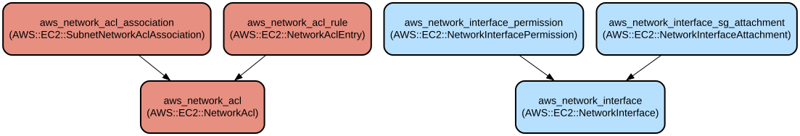

# AWS Network Infrastructure Module for Terraform

This Terraform module provides a comprehensive solution for managing AWS network infrastructure components including Network ACLs, Network Interfaces, and their associated configurations. It enables fine-grained control over network security and interface management while maintaining AWS best practices.

The module offers extensive customization options for network configurations, including IPv4/IPv6 addressing, security group attachments, and network ACL rules. It supports both basic and advanced networking scenarios, from simple network interface creation to complex multi-interface setups with custom permissions and security groups.

## Repository Structure
```
modules/aws_network_module/
├── main.tf           # Core resource definitions for network components
├── variables.tf      # Input variables for network configuration
├── outputs.tf        # Output values for created resources
└── versions.tf       # Terraform and provider version constraints
```

## Usage Instructions
### Prerequisites

- Terraform >= 1.5.7
- AWS Provider >= 5.94.1
- AWS CLI configured with appropriate credentials
- IAM permissions for creating and managing:
  - Network ACLs
  - Network Interfaces
  - Security Groups
  - Network Interface Permissions

### Installation

1. Add the module to your Terraform configuration:

```hcl
module "network" {
  source = "path/to/aws_network_module"

  vpc_id     = "vpc-xxxxxxxx"
  subnet_ids = ["subnet-xxxxxxxx"]
  tags = {
    Environment = "Production"
    Project     = "NetworkInfra"
  }
  # Additional required variables
}
```

2. Initialize Terraform:
```bash
terraform init
```

### Quick Start

1. Create a basic network ACL configuration:

```hcl
module "network" {
  source = "path/to/aws_network_module"

  vpc_id     = "vpc-xxxxxxxx"
  subnet_ids = ["subnet-xxxxxxxx"]
  
  # Network ACL Rule Configuration
  network_acl_id = "acl-xxxxxxxx"
  rule_number    = 100
  egress        = false
  rule_protocol = "tcp"
  rule_action   = "allow"
  cidr_block    = "0.0.0.0/0"
  from_port     = 80
  to_port       = 80
  
  tags = {
    Name = "web-server-acl"
  }
}
```

### More Detailed Examples

1. Creating a Network Interface with IPv6 support:

```hcl
module "network" {
  source = "path/to/aws_network_module"

  subnet_id             = "subnet-xxxxxxxx"
  enable_primary_ipv6   = true
  ipv6_address_count    = 1
  security_groups       = ["sg-xxxxxxxx"]
  source_dest_check     = true
  
  attach_network_interface = true
  instance_id             = "i-xxxxxxxx"
  device_index           = 1
  
  tags = {
    Name = "ipv6-enabled-eni"
  }
}
```

### Troubleshooting

Common issues and solutions:

1. Network ACL Rule Conflicts
   - **Problem**: Network ACL rules not applying as expected
   - **Solution**: Check rule numbers for conflicts. Rules are evaluated in order from lowest to highest
   - **Debug Command**: 
     ```bash
     aws ec2 describe-network-acls --network-acl-id acl-xxxxxxxx
     ```

2. Network Interface Attachment Failures
   - **Problem**: ENI fails to attach to instance
   - **Solution**: Verify instance type supports additional network interfaces
   - **Debug Steps**:
     1. Check instance limits: `aws ec2 describe-instance-attribute --instance-id i-xxxxxxxx --attribute maxNetworkInterfaces`
     2. Verify security group compatibility
     3. Ensure device_index is not already in use

## Data Flow
The module manages network resources by creating and configuring ACLs and network interfaces based on provided variables.

```ascii
Input Variables
      ↓
[Network ACL Creation]
      ↓
[ACL Rule Application]
      ↓
[Network Interface Setup]
      ↓
[Security Group Association]
      ↓
[Permission Management]
      ↓
Output Values
```

Component Interactions:
1. Network ACL creation establishes base network security
2. ACL rules define traffic flow permissions
3. Network interfaces connect to specified subnets
4. Security groups provide additional security layer
5. Permissions control access to network interfaces
6. All components are tagged for resource management

## Infrastructure



AWS Resources Created:

**Network ACL Resources:**
- aws_network_acl
- aws_network_acl_association
- aws_network_acl_rule

**Network Interface Resources:**
- aws_network_interface
- aws_network_interface_permission
- aws_network_interface_sg_attachment

Each resource is fully configurable through variables and includes comprehensive tagging support for resource management.