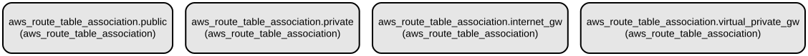

# AWS Route Table Association Terraform Module - Streamline VPC Network Routing Configuration

This Terraform module manages AWS VPC route table associations, providing a flexible and maintainable way to configure routing between subnets, Internet Gateways, and VPN Gateways. It simplifies the process of setting up network routing in AWS VPC environments by automatically handling route table associations based on your infrastructure requirements.

The module supports both public and private subnet configurations, with the ability to associate route tables with Internet Gateways and Virtual Private Gateways. It implements conditional resource creation based on configuration flags, allowing for flexible deployment scenarios while maintaining clean and efficient infrastructure code.

## Repository Structure
```
modules/aws_route_table_association/
├── main.tf                 # Core logic for route table associations
├── outputs.tf             # Defines output variables for resource IDs
├── variables.tf          # Input variable definitions for module configuration
└── versions.tf           # Terraform and provider version constraints
```

## Usage Instructions
### Prerequisites
- Terraform >= 1.5.7
- AWS Provider >= 5.94.1
- AWS CLI configured with appropriate credentials
- Existing VPC infrastructure (subnets, route tables, and gateways)

### Installation

1. Include the module in your Terraform configuration:
```hcl
module "route_table_association" {
  source = "path/to/modules/aws_route_table_association"

  create_vpc         = true
  create_igw        = true
  enable_vpn_gateway = false
  
  public_subnets      = ["subnet-123456", "subnet-789012"]
  private_subnets     = ["subnet-345678", "subnet-901234"]
  private_route_tables = ["rtb-123456", "rtb-789012"]
}
```

### Quick Start

1. Initialize Terraform:
```bash
terraform init
```

2. Review the planned changes:
```bash
terraform plan
```

3. Apply the configuration:
```bash
terraform get
terraform apply
```

### More Detailed Examples

1. Creating associations for public subnets only:
```hcl
module "route_table_association" {
  source = "path/to/modules/aws_route_table_association"

  create_vpc         = true
  create_igw        = true
  enable_vpn_gateway = false
  
  public_subnets      = ["subnet-123456"]
  private_subnets     = []
  private_route_tables = []
}
```

2. Setting up VPN Gateway associations:
```hcl
module "route_table_association" {
  source = "path/to/modules/aws_route_table_association"

  create_vpc         = true
  create_igw        = false
  enable_vpn_gateway = true
  
  public_subnets      = []
  private_subnets     = ["subnet-345678"]
  private_route_tables = ["rtb-123456"]
}
```

### Troubleshooting

Common issues and solutions:

1. Route Table Association Failure
   - Error: "Resource not found"
   - Solution: Verify that all subnet and route table IDs exist and are correct
   - Command to verify resources:
   ```bash
   aws ec2 describe-route-tables --route-table-ids rtb-123456
   ```

2. Concurrent Association Updates
   - Error: "Resource already associated"
   - Solution: Ensure no conflicting associations exist
   - Debug using:
   ```bash
   aws ec2 describe-route-tables --filters "Name=association.subnet-id,Values=subnet-123456"
   ```

## Data Flow
The module manages the flow of routing configurations in your VPC by creating associations between network components.

```ascii
┌──────────────┐      ┌─────────────────┐      ┌────────────────┐
│  Subnets     │──────▶ Route Tables    │──────▶ Gateways       │
│ (Public/     │      │ (Public/Private)│      │ (IGW/VPN)     │
│  Private)    │      │                 │      │               │
└──────────────┘      └─────────────────┘      └────────────────┘
```

Key component interactions:
- Public subnets are associated with public route tables
- Private subnets are associated with private route tables
- Internet Gateway is associated with public route table when enabled
- VPN Gateway is associated with dedicated route table when enabled
- Associations are created based on boolean flags and subnet availability
- Resource creation is conditional based on input variables

## Infrastructure


The module creates the following AWS resources:

**Route Table Associations:**
- `aws_route_table_association.public`: Associates public subnets with public route table
- `aws_route_table_association.private`: Associates private subnets with private route tables
- `aws_route_table_association.internet_gw`: Associates Internet Gateway with route table
- `aws_route_table_association.virtual_private_gw`: Associates VPN Gateway with route table