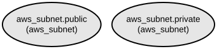

# AWS Subnet Terraform Module: Flexible Public and Private Subnet Creation with IPv6 Support

This Terraform module provides a streamlined way to create and manage public and private subnets within an AWS VPC. The module supports advanced networking features including IPv6 configuration, DNS management, and automatic IP address assignment, making it ideal for building scalable and modern cloud infrastructure.

The module enables fine-grained control over subnet configurations while maintaining infrastructure as code best practices. It supports creating multiple subnets across different availability zones with customizable CIDR blocks and network settings. The module includes comprehensive IPv6 support, DNS configuration options, and automatic IP address management capabilities.

## Repository Structure
```
modules/aws_subnet/
├── main.tf           # Core resource definitions for public and private subnet creation
├── variables.tf      # Input variable definitions including VPC ID, subnet configurations
├── outputs.tf        # Output definitions for subnet IDs
└── versions.tf       # Terraform and provider version constraints
```

## Usage Instructions
### Prerequisites
- Terraform >= 1.5.7
- AWS Provider >= 5.94.1
- AWS CLI configured with appropriate credentials
- Existing VPC in your AWS account

### Installation

1. Add the module to your Terraform configuration:

```hcl
module "subnets" {
  source = "path/to/modules/aws_subnet"

  vpc_id = "vpc-xxxxxxxx"
  tags = {
    Environment = "Production"
    Terraform   = "true"
  }

  public_subnets = [
    {
      cidr_block        = "10.0.1.0/24"
      availability_zone = "us-west-2a"
      map_public_ip_on_launch = true
    }
  ]

  private_subnets = [
    {
      cidr_block        = "10.0.2.0/24"
      availability_zone = "us-west-2a"
    }
  ]
}
```

2. Initialize Terraform:
```bash
terraform init
```

3. Review the planned changes:
```bash
terraform plan
```

4. Apply the configuration:
```bash
terraform get
terraform apply
```

### More Detailed Examples

1. Creating subnets with IPv6 support:
```hcl
module "ipv6_subnets" {
  source = "path/to/modules/aws_subnet"

  vpc_id = "vpc-xxxxxxxx"
  
  public_subnets = [
    {
      cidr_block        = "10.0.1.0/24"
      availability_zone = "us-west-2a"
      ipv6_cidr_block  = "2001:db8::/64"
      assign_ipv6_address_on_creation = true
      enable_dns64     = true
    }
  ]

  private_subnets = []
  
  tags = {
    Environment = "Development"
  }
}
```

2. Multi-AZ subnet configuration:
```hcl
module "multi_az_subnets" {
  source = "path/to/modules/aws_subnet"

  vpc_id = "vpc-xxxxxxxx"
  
  public_subnets = [
    {
      cidr_block        = "10.0.1.0/24"
      availability_zone = "us-west-2a"
    },
    {
      cidr_block        = "10.0.2.0/24"
      availability_zone = "us-west-2b"
    }
  ]

  private_subnets = [
    {
      cidr_block        = "10.0.3.0/24"
      availability_zone = "us-west-2a"
    },
    {
      cidr_block        = "10.0.4.0/24"
      availability_zone = "us-west-2b"
    }
  ]

  tags = {
    Environment = "Production"
  }
}
```

### Troubleshooting

Common issues and solutions:

1. CIDR Block Conflicts
```
Error: Error creating subnet: InvalidSubnet.Conflict
```
- Verify that CIDR blocks don't overlap with existing subnets
- Ensure CIDR blocks are within VPC range
- Use `aws ec2 describe-subnets` to list existing subnets

2. Availability Zone Issues
```
Error: Error creating subnet: InvalidParameterValue
```
- Confirm AZ is available in your AWS account
- Verify AZ naming convention matches region
- Use `aws ec2 describe-availability-zones` to list available AZs

3. IPv6 Configuration
- Enable IPv6 support on the VPC first
- Ensure IPv6 CIDR blocks are valid
- Verify IPv6 pool availability in the region

## Data Flow
The module manages subnet creation through a systematic process of resource provisioning and configuration.

```ascii
Input Variables    ┌─────────────────┐    AWS Resources
  (vpc_id,     ───►│ Terraform Module├───► (Public Subnets,
   subnet      │   │                 │     Private Subnets)
   configs)    │   └─────────────────┘
               │          │
               │          ▼
Tags ──────────┘    Output Values
                    (Subnet IDs)
```

Key component interactions:
- Input variables define VPC context and subnet configurations
- Module creates subnets based on provided configurations
- AWS Provider handles actual resource creation
- Subnet resources are tagged for identification
- Module outputs subnet IDs for reference
- IPv6 configurations are applied when specified
- DNS settings are configured based on input parameters

## Infrastructure



AWS Resources created by this module:

### Subnet Resources
- `aws_subnet.public`: Public subnets with configurable IPv4/IPv6 addressing
- `aws_subnet.private`: Private subnets with configurable IPv4/IPv6 addressing

Each subnet resource includes:
- VPC association
- CIDR block assignment
- Availability zone placement
- Optional IPv6 configuration
- DNS configuration
- IP address assignment settings
- Resource tagging