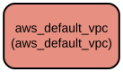

# AWS Default VPC Management Terraform Module

This Terraform module manages the configuration of the default VPC in AWS environments. It provides a streamlined way to control DNS settings and apply consistent tagging to your default VPC, ensuring proper network configuration and resource organization in your AWS infrastructure.

The module enables fine-grained control over the default VPC's DNS capabilities and tagging strategy. It allows organizations to maintain consistent network configurations across different AWS accounts and regions while following infrastructure-as-code best practices. The module supports enabling/disabling DNS support and hostname features, along with flexible tagging options for resource management and cost allocation.

## Repository Structure
```
modules/default_vpc/
├── main.tf           # Core VPC resource configuration and management logic
├── outputs.tf        # Defines output variables for VPC attributes
├── variables.tf      # Input variable definitions for module configuration
└── versions.tf       # Terraform and provider version constraints
```

## Usage Instructions
### Prerequisites
- Terraform >= 1.5.7
- AWS Provider >= 5.94.1
- AWS credentials configured with appropriate permissions to manage VPC resources
- AWS CLI installed and configured (for credential management)

### Installation

1. Add the module to your Terraform configuration:

```hcl
module "default_vpc" {
  source = "path/to/modules/default_vpc"

  manage_default_vpc              = true
  default_vpc_enable_dns_support  = true
  default_vpc_enable_dns_hostnames = true
  default_vpc_tags = {
    Environment = "Production"
    ManagedBy   = "Terraform"
  }
  general_tags = {
    Organization = "MyCompany"
    Team        = "Infrastructure"
  }
}
```

2. Initialize Terraform:
```bash
terraform init
```

### Quick Start

1. Configure your AWS credentials:
```bash
export AWS_ACCESS_KEY_ID="your_access_key"
export AWS_SECRET_ACCESS_KEY="your_secret_key"
export AWS_REGION="your_region"
```

2. Apply the configuration:
```bash
terraform plan
terraform apply
```

### More Detailed Examples

1. Managing default VPC with custom DNS settings:
```hcl
module "default_vpc" {
  source = "path/to/modules/default_vpc"

  manage_default_vpc              = true
  default_vpc_enable_dns_support  = true
  default_vpc_enable_dns_hostnames = false
  default_vpc_tags = {
    Environment = "Development"
    Purpose     = "Testing"
  }
  general_tags = {
    CostCenter = "DevOps"
  }
}
```

### Troubleshooting

Common issues and solutions:

1. **Error: Cannot modify default VPC**
   - Ensure your AWS credentials have sufficient permissions
   - Verify that the default VPC exists in the region
   - Check if another process is managing the default VPC

2. **DNS Settings Not Applying**
   - Confirm that `manage_default_vpc` is set to `true`
   - Verify variable values in your terraform plan output
   - Check AWS console for any conflicting configurations

Debug Mode:
```bash
export TF_LOG=DEBUG
export TF_LOG_PATH=./terraform.log
terraform plan
```

## Data Flow

The module manages the default VPC configuration by applying DNS settings and tags through the AWS provider. It processes input variables to configure the VPC and outputs the resulting VPC attributes.

```ascii
Input Variables    AWS Provider       Default VPC
     │                  │                 │
     ▼                  ▼                 ▼
[Configuration] → [AWS API Calls] → [VPC Settings]
     │                  │                 │
     └──────────────────┴────────► [Output Values]
```

Component interactions:
1. Module receives configuration through input variables
2. AWS provider authenticates with AWS API
3. Provider manages default VPC resource based on configuration
4. VPC settings are applied through AWS API calls
5. Module outputs VPC attributes for reference

## Infrastructure



AWS Resources:
- **VPC**
  - Type: `aws_default_vpc`
  - Purpose: Manages the default VPC configuration
  - Features:
    - DNS support configuration
    - DNS hostnames configuration
    - Custom tagging support