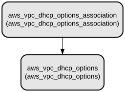

# AWS VPC DHCP Options Terraform Module - Simplify VPC DHCP Configuration Management

This Terraform module manages DHCP Options Sets for AWS VPCs, providing a streamlined way to configure and manage DHCP settings including domain names, DNS servers, NTP servers, and NetBIOS configurations. It simplifies the process of creating and associating DHCP options with VPCs while maintaining infrastructure as code best practices.

The module offers comprehensive DHCP configuration capabilities for AWS VPCs, allowing you to define custom domain names, specify multiple DNS servers, configure NTP servers, and set up NetBIOS options. It includes built-in support for resource tagging and conditional creation, making it suitable for both simple and complex network configurations in AWS environments.

## Repository Structure
```
modules/dhcp_options/
├── main.tf           # Core resource definitions for DHCP options and associations
├── outputs.tf        # Output definitions for DHCP options configuration
├── variables.tf      # Input variable definitions for module configuration
└── versions.tf       # Terraform and provider version constraints
```

## Usage Instructions
### Prerequisites
- Terraform >= 1.5.7
- AWS Provider >= 5.94.1
- AWS account with appropriate permissions
- Existing VPC ID (if associating with an existing VPC)

### Installation

1. Include the module in your Terraform configuration:
```hcl
module "dhcp_options" {
  source = "path/to/modules/dhcp_options"

  create_vpc                        = true
  enable_dhcp_options              = true
  vpc_id                           = "vpc-xxxxxxxx"
  dhcp_options_domain_name         = "example.com"
  dhcp_options_domain_name_servers = ["AmazonProvidedDNS"]
  dhcp_options_ntp_servers         = ["169.254.169.123"]
  dhcp_options_netbios_name_servers = []
  dhcp_options_netbios_node_type   = "2"
  
  dhcp_options_tags = {
    Environment = "Production"
  }
  
  general_tags = {
    Project = "MyProject"
  }
}
```

2. Initialize Terraform:
```bash
terraform init
```

3. Review the planned changes:
```bash
terraform plan
```

4. Apply the configuration:
```bash
terraform apply
```

### Quick Start
1. Create a basic DHCP Options configuration:
```hcl
module "basic_dhcp" {
  source = "path/to/modules/dhcp_options"

  create_vpc          = true
  enable_dhcp_options = true
  vpc_id             = "vpc-123456789"
  
  dhcp_options_domain_name         = "internal.example.com"
  dhcp_options_domain_name_servers = ["AmazonProvidedDNS"]
  dhcp_options_ntp_servers         = []
  dhcp_options_netbios_name_servers = []
  dhcp_options_netbios_node_type   = ""
  
  dhcp_options_tags = {}
  general_tags      = {}
}
```

### More Detailed Examples

1. Custom DNS and NTP Configuration:
```hcl
module "custom_dhcp" {
  source = "path/to/modules/dhcp_options"

  create_vpc          = true
  enable_dhcp_options = true
  vpc_id             = "vpc-123456789"
  
  dhcp_options_domain_name         = "corp.example.com"
  dhcp_options_domain_name_servers = ["10.0.0.2", "10.0.0.3"]
  dhcp_options_ntp_servers         = ["169.254.169.123", "10.0.0.4"]
  dhcp_options_netbios_name_servers = ["10.0.0.5"]
  dhcp_options_netbios_node_type   = "2"
  
  dhcp_options_tags = {
    Environment = "Production"
    Service     = "Core"
  }
  
  general_tags = {
    Project     = "Infrastructure"
    ManagedBy   = "Terraform"
  }
}
```

### Troubleshooting

Common issues and solutions:

1. DHCP Options Not Applying
- Problem: DHCP options not being applied to instances
- Solution: 
  * Verify the VPC ID is correct
  * Ensure the DHCP options association is created
  * Check if `create_vpc` and `enable_dhcp_options` are set to `true`

2. Invalid DHCP Configuration
- Problem: Terraform apply fails with invalid DHCP configuration
- Solution:
  * Ensure domain name servers are valid IP addresses or "AmazonProvidedDNS"
  * Verify NTP servers are valid IP addresses
  * Check if NetBIOS node type is a valid value (1, 2, 4, or 8)

Debug Mode:
```bash
export TF_LOG=DEBUG
export TF_LOG_PATH=./terraform.log
terraform apply
```

## Data Flow
The module manages DHCP configuration by creating a DHCP Options Set and associating it with a VPC. The configuration flows from variable inputs through resource creation to VPC association.

```ascii
Input Variables
      ↓
DHCP Options Set Creation
      ↓
VPC Association
      ↓
Output Values
```

Component interactions:
1. Variables define DHCP configuration parameters
2. Module creates AWS DHCP Options Set with specified settings
3. Module associates DHCP Options Set with target VPC
4. Instances in VPC receive DHCP configuration
5. Output values provide reference information

## Infrastructure


AWS Resources Created:
- aws_vpc_dhcp_options: Creates DHCP Options Set with specified configuration
- aws_vpc_dhcp_options_association: Associates DHCP Options Set with specified VPC

The module creates these resources conditionally based on the `create_vpc` and `enable_dhcp_options` variables.