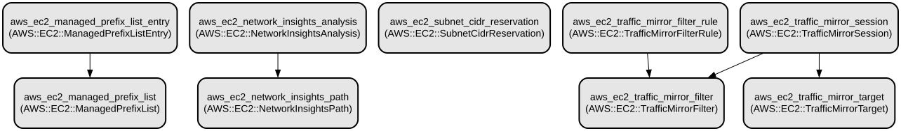

# AWS EC2 Networking Module: Comprehensive Network Management and Traffic Analysis

This Terraform module provides a comprehensive solution for managing AWS EC2 networking components, including prefix lists, network insights, subnet CIDR reservations, and traffic mirroring. It enables advanced network analysis, traffic monitoring, and network security configuration in AWS environments.

The module offers sophisticated networking capabilities through several key features:
- Managed prefix lists for efficient IP address management
- Network insights for analyzing connectivity between resources
- Subnet CIDR reservation for IP address planning
- Traffic mirroring for network monitoring and security analysis
- Flexible configuration options for different networking scenarios

## Repository Structure
```
.
└── modules
    └── ec2_networking/
        ├── main.tf           # Core resource definitions for networking components
        ├── outputs.tf        # Output definitions for resource IDs
        ├── variables.tf      # Input variable definitions with comprehensive documentation
        └── versions.tf       # Terraform and provider version constraints
```

## Usage Instructions
### Prerequisites
- Terraform >= 1.5.7
- AWS Provider >= 5.94.1
- AWS CLI configured with appropriate credentials
- IAM permissions for managing EC2 networking resources

### Installation
1. Include the module in your Terraform configuration:
```hcl
module "ec2_networking" {
  source = "path/to/modules/ec2_networking"
  
  # Required variables
  prefix_list_name = "my-prefix-list"
  address_family   = "IPv4"
  max_entries      = 10
  # Add other required variables
}
```

### Quick Start
1. Create a basic prefix list:
```hcl
module "ec2_networking" {
  source = "path/to/modules/ec2_networking"
  
  prefix_list_name    = "allow-internal"
  address_family      = "IPv4"
  max_entries         = 5
  entry_cidr         = "10.0.0.0/16"
  entry_description  = "Internal network CIDR"
  
  tags = {
    Environment = "production"
  }
}
```

### More Detailed Examples
1. Configure traffic mirroring:
```hcl
module "ec2_networking" {
  source = "path/to/modules/ec2_networking"
  
  # Traffic Mirror Filter
  mirror_filter_description = "Production traffic monitoring"
  
  # Traffic Mirror Rule
  traffic_direction    = "ingress"
  rule_number         = 100
  rule_action         = "accept"
  dest_cidr_block     = "10.0.0.0/16"
  source_cidr_block   = "0.0.0.0/0"
  
  # Port ranges
  dest_port_from      = 80
  dest_port_to        = 443
  source_port_from    = 1024
  source_port_to      = 65535
}
```

### Troubleshooting
Common issues and solutions:

1. Prefix List Creation Fails
```
Error: Error creating EC2 Managed Prefix List
```
- Verify IAM permissions include `ec2:CreateManagedPrefixList`
- Ensure max_entries value is within AWS limits (1-1000)

2. Traffic Mirroring Issues
- Check network interface exists and is in the correct VPC
- Verify CIDR blocks are valid and non-overlapping
- Ensure session numbers are unique within the account

## Data Flow
The module manages network resources and their relationships in AWS EC2 environments.

```ascii
[Prefix List] --> [Network Insights] --> [Analysis]
       |
       v
[Traffic Mirror Filter] --> [Filter Rules]
       |
       v
[Mirror Target] --> [Mirror Session]
```

Component interactions:
1. Prefix Lists define allowed IP ranges
2. Network Insights analyze paths between resources
3. Traffic Mirror Filters determine what traffic to capture
4. Mirror Sessions connect filters to targets
5. Mirror Targets receive the mirrored traffic

## Infrastructure


AWS Resources Created:
- EC2:
  - Managed Prefix List (`aws_ec2_managed_prefix_list`)
  - Network Insights Path (`aws_ec2_network_insights_path`)
  - Network Insights Analysis (`aws_ec2_network_insights_analysis`)
  - Subnet CIDR Reservation (`aws_ec2_subnet_cidr_reservation`)
  - Traffic Mirror Filter (`aws_ec2_traffic_mirror_filter`)
  - Traffic Mirror Filter Rule (`aws_ec2_traffic_mirror_filter_rule`)
  - Traffic Mirror Target (`aws_ec2_traffic_mirror_target`)
  - Traffic Mirror Session (`aws_ec2_traffic_mirror_session`)