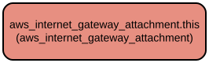

# AWS Internet Gateway Attachment Terraform Module

This Terraform module manages the attachment of an AWS Internet Gateway to a Virtual Private Cloud (VPC). It provides a simple and reusable way to establish internet connectivity for your VPC resources by creating the necessary attachment between an Internet Gateway and a VPC.

The module encapsulates the configuration required for creating an Internet Gateway attachment in AWS, following infrastructure-as-code best practices. It handles the relationship between the Internet Gateway and VPC resources, making it easier to manage and maintain your AWS network infrastructure.

## Repository Structure
```
modules/internet_gateway_attachment/
├── main.tf                 # Defines the Internet Gateway attachment resource
├── outputs.tf             # Exposes the attachment ID for reference
├── variables.tf          # Declares required input variables
└── versions.tf           # Specifies Terraform and provider version requirements
```

## Usage Instructions

### Prerequisites
- Terraform >= 1.5.7
- AWS Provider >= 5.94.1
- AWS credentials configured with appropriate permissions
- Existing Internet Gateway
- Existing VPC

### Installation

1. Add the module to your Terraform configuration:

```hcl
module "internet_gateway_attachment" {
  source = "path/to/modules/internet_gateway_attachment"

  internet_gateway_id = "igw-12345678"
  vpc_id             = "vpc-12345678"
}
```

2. Initialize Terraform:
```bash
terraform init
```

### Quick Start

1. Create a new Terraform configuration file (e.g., `main.tf`):

```hcl
module "internet_gateway_attachment" {
  source = "path/to/modules/internet_gateway_attachment"

  internet_gateway_id = aws_internet_gateway.example.id
  vpc_id             = aws_vpc.example.id
}
```

2. Apply the configuration:
```bash
terraform plan
terraform apply
```

### More Detailed Examples

Creating a complete VPC setup with Internet Gateway attachment:

```hcl
# Create VPC
resource "aws_vpc" "example" {
  cidr_block = "10.0.0.0/16"
  
  tags = {
    Name = "example-vpc"
  }
}

# Create Internet Gateway
resource "aws_internet_gateway" "example" {
  tags = {
    Name = "example-igw"
  }
}

# Attach Internet Gateway to VPC
module "internet_gateway_attachment" {
  source = "path/to/modules/internet_gateway_attachment"

  internet_gateway_id = aws_internet_gateway.example.id
  vpc_id             = aws_vpc.example.id
}
```

### Troubleshooting

Common issues and solutions:

1. **Error: Invalid Internet Gateway ID**
   - Verify that the Internet Gateway exists and the ID is correct
   - Check AWS credentials have permission to describe Internet Gateways
   - Use `aws ec2 describe-internet-gateways` to validate the Internet Gateway ID

2. **Error: Invalid VPC ID**
   - Confirm the VPC exists and the ID is correct
   - Ensure AWS credentials have permission to describe VPCs
   - Use `aws ec2 describe-vpcs` to validate the VPC ID

3. **Error: Attachment Already Exists**
   - Check if the VPC already has an Internet Gateway attached
   - Use AWS Console or CLI to verify existing attachments
   - Remove existing attachment before creating a new one

## Data Flow

The module creates an attachment between an Internet Gateway and a VPC, enabling internet connectivity for resources within the VPC.

```ascii
┌──────────────┐         ┌─────────────┐         ┌───────────┐
│     VPC      │◄────────│  Attachment │◄────────│    IGW    │
└──────────────┘         └─────────────┘         └───────────┘
```

Key component interactions:
1. Module accepts Internet Gateway ID and VPC ID as inputs
2. AWS provider validates the existence of both resources
3. Attachment resource creates the connection between IGW and VPC
4. Attachment ID is generated and exposed as an output
5. VPC routing tables need to be configured separately to utilize the Internet Gateway

## Infrastructure



The module manages the following AWS resources:

**Internet Gateway Attachment**
- Resource Type: `aws_internet_gateway_attachment`
- Purpose: Creates a connection between an Internet Gateway and a VPC
- Configuration:
  - Requires Internet Gateway ID
  - Requires VPC ID
  - Outputs the attachment ID in the format `igw_id:vpc_id`