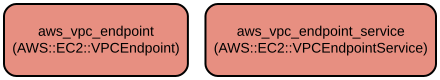

# AWS VPC Endpoint Terraform Module - Simplified VPC Endpoint and Service Management

This Terraform module provides a streamlined way to create and manage AWS VPC Endpoints and VPC Endpoint Services. It enables secure access to AWS services without traversing the public internet and allows you to create private endpoint services for your own applications.

The module supports both Interface and Gateway endpoint types with comprehensive configuration options including security groups, subnet associations, DNS settings, and load balancer integrations. It implements AWS best practices for VPC endpoint configuration and provides flexible tagging capabilities for resource management.

## Repository Structure
```
modules/vpc_endpoint/
├── main.tf           # Core resource definitions for VPC endpoints and endpoint services
├── variables.tf      # Input variable definitions with type constraints and descriptions
├── outputs.tf        # Output definitions for endpoint IDs and DNS entries
└── versions.tf       # Terraform and provider version constraints
```

## Usage Instructions
### Prerequisites
- Terraform >= 1.5.7
- AWS Provider >= 5.94.1
- AWS CLI configured with appropriate credentials
- Existing VPC infrastructure
- IAM permissions to create VPC endpoints and endpoint services

### Installation
1. Include the module in your Terraform configuration:
```hcl
module "vpc_endpoints" {
  source = "path/to/modules/vpc_endpoint"
  
  create_endpoint = true
  vpc_id         = "vpc-12345678"
  
  endpoints = {
    s3 = {
      service_name      = "com.amazonaws.region.s3"
      vpc_endpoint_type = "Gateway"
      route_table_ids   = ["rtb-12345678"]
    }
  }
  
  endpoint_tags = {
    Environment = "Production"
  }
  
  general_tags = {
    Project = "MyProject"
  }
}
```

### Quick Start
1. Create a Gateway endpoint for S3:
```hcl
endpoints = {
  s3 = {
    service_name      = "com.amazonaws.region.s3"
    vpc_endpoint_type = "Gateway"
    route_table_ids   = ["rtb-12345678"]
  }
}
```

2. Create an Interface endpoint for ECR:
```hcl
endpoints = {
  ecr = {
    service_name        = "com.amazonaws.region.ecr.dkr"
    vpc_endpoint_type   = "Interface"
    subnet_ids          = ["subnet-12345678"]
    security_group_ids  = ["sg-12345678"]
    private_dns_enabled = true
  }
}
```

### More Detailed Examples
1. Creating a VPC Endpoint Service:
```hcl
endpoint_services = {
  my_service = {
    acceptance_required         = true
    network_load_balancer_arns = ["arn:aws:elasticloadbalancing:region:account:loadbalancer/net/my-nlb/123456789"]
    allowed_principals         = ["arn:aws:iam::123456789012:root"]
    private_dns_name          = "service.example.com"
  }
}
```

### Troubleshooting
Common issues and solutions:

1. Endpoint Creation Timeout
   - Error: "Error creating VPC Endpoint: TimeoutError"
   - Solution: Adjust the timeout values in the endpoint_timeouts variable
   ```hcl
   endpoint_timeouts = {
     create = "15m"
     update = "15m"
     delete = "15m"
   }
   ```

2. DNS Resolution Issues
   - Problem: Private DNS not working for Interface endpoints
   - Check that private_dns_enabled is set to true
   - Verify that enableDnsHostnames and enableDnsSupport are enabled in your VPC

## Data Flow
The module manages the creation and configuration of VPC endpoints and endpoint services, handling the networking infrastructure required for private AWS service access.

```ascii
                                    ┌──────────────────┐
                                    │   AWS Services   │
                                    └────────┬─────────┘
                                            │
                    ┌───────────────────────┼───────────────────────┐
                    │                       │                       │
            ┌───────┴────────┐     ┌───────┴────────┐     ┌───────┴────────┐
            │ Gateway        │     │  Interface     │     │ Endpoint       │
            │ Endpoint      │     │  Endpoint      │     │ Service        │
            └───────┬────────┘     └───────┬────────┘     └───────┬────────┘
                    │                      │                       │
                    └──────────────────────┼───────────────────────┘
                                          │
                                    ┌─────┴─────┐
                                    │    VPC    │
                                    └───────────┘
```

Key Component Interactions:
1. VPC Endpoints connect directly to AWS services through AWS's private network
2. Gateway endpoints route traffic through VPC route tables
3. Interface endpoints create ENIs in specified subnets
4. Security groups control access to Interface endpoints
5. DNS resolution handles service name resolution to private IP addresses
6. Load balancers distribute traffic for endpoint services
7. IAM policies control access to endpoints and services

## Infrastructure


The module creates the following AWS resources:

### VPC Endpoints
- Type: aws_vpc_endpoint
- Purpose: Creates Interface or Gateway endpoints for AWS services
- Configuration: Supports security groups, subnets, route tables, and DNS options

### VPC Endpoint Services
- Type: aws_vpc_endpoint_service
- Purpose: Creates endpoint services for private service access
- Configuration: Supports load balancer integration and access control