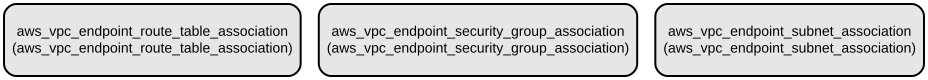

# AWS VPC Endpoint Association Module for Terraform

This Terraform module manages associations between AWS VPC Endpoints and network resources including route tables, security groups, and subnets. It simplifies the process of connecting VPC endpoints to your network infrastructure by providing a standardized way to create and manage these associations.

The module supports three types of VPC endpoint associations, each serving a specific networking purpose:
- Route Table associations to control traffic routing
- Security Group associations to manage access control
- Subnet associations to define endpoint availability within your VPC

## Repository Structure
```
modules/vpc_endpoint_association/
├── main.tf                 # Core resource definitions for VPC endpoint associations
├── outputs.tf             # Output definitions for association IDs
├── variables.tf          # Input variable definitions for the module
└── versions.tf          # Terraform and provider version constraints
```

## Usage Instructions
### Prerequisites
- Terraform >= 1.5.7
- AWS Provider >= 5.94.1
- AWS credentials configured with appropriate permissions
- Existing VPC endpoints, route tables, security groups, and subnets

### Installation

1. Add the module to your Terraform configuration:

```hcl
module "vpc_endpoint_association" {
  source = "path/to/modules/vpc_endpoint_association"

  route_table_associations = {
    "association1" = {
      vpc_endpoint_id = "vpce-123456789"
      route_table_id  = "rtb-123456789"
    }
  }

  sg_associations = {
    "association1" = {
      vpc_endpoint_id             = "vpce-123456789"
      security_group_id           = "sg-123456789"
      replace_default_association = false
    }
  }

  subnet_associations = {
    "association1" = {
      vpc_endpoint_id = "vpce-123456789"
      subnet_id       = "subnet-123456789"
    }
  }
}
```

### Quick Start

1. Create a new Terraform configuration file (e.g., `main.tf`)
2. Copy the module usage example above
3. Modify the values to match your environment
4. Run the following commands:

```bash
terraform init
terraform plan
terraform apply
```

### More Detailed Examples

**Route Table Association Only:**
```hcl
module "vpc_endpoint_association" {
  source = "path/to/modules/vpc_endpoint_association"

  route_table_associations = {
    "gateway_endpoint" = {
      vpc_endpoint_id = "vpce-123456789"
      route_table_id  = "rtb-123456789"
    }
    "second_route" = {
      vpc_endpoint_id = "vpce-987654321"
      route_table_id  = "rtb-987654321"
    }
  }

  sg_associations    = {}
  subnet_associations = {}
}
```

### Troubleshooting

Common issues and solutions:

1. **Error: Invalid VPC Endpoint ID**
   - Verify that the VPC endpoint exists and is in the correct region
   - Check the VPC endpoint ID format (should start with "vpce-")
   - Ensure you have permissions to access the VPC endpoint

2. **Error: Cannot create association**
   - Verify that the target resource (route table/security group/subnet) exists
   - Check that the resources are in the same VPC
   - Ensure you have the necessary IAM permissions

Debug Mode:
```bash
export TF_LOG=DEBUG
export TF_LOG_PATH=./terraform.log
terraform plan
```

## Data Flow
The module manages the association of VPC endpoints with network resources by creating and maintaining the relationships between these components.

```ascii
VPC Endpoint ──┬─── Route Table Association
               ├─── Security Group Association
               └─── Subnet Association
```

Component interactions:
1. Route table associations direct traffic to/from the VPC endpoint
2. Security group associations control access to the VPC endpoint
3. Subnet associations determine where the endpoint is accessible
4. Associations are created in parallel using Terraform's for_each
5. Changes to associations trigger updates to the respective AWS resources

## Infrastructure



The module creates the following AWS resources:

**VPC Endpoint Associations:**
- `aws_vpc_endpoint_route_table_association`: Associates VPC endpoints with route tables
- `aws_vpc_endpoint_security_group_association`: Associates VPC endpoints with security groups
- `aws_vpc_endpoint_subnet_association`: Associates VPC endpoints with subnets

Each resource type supports multiple associations through map variables, allowing for flexible and scalable configuration.