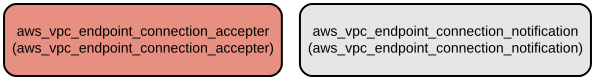

# AWS VPC Endpoint Connection Management Module for Terraform

This Terraform module manages AWS VPC endpoint connections and their associated notifications. It provides automated acceptance of VPC endpoint connections and configurable notification systems for connection events, streamlining the management of VPC endpoint infrastructure.

The module offers two primary features:
- Automated acceptance of VPC endpoint connections with configurable rules
- Flexible notification system for VPC endpoint connection events through SNS integration

## Repository Structure
```
modules/vpc_endpoint_connection/
├── main.tf                 # Core resource definitions for VPC endpoint connections and notifications
├── outputs.tf             # Output definitions for resource IDs
├── variables.tf          # Input variable definitions for module configuration
└── versions.tf          # Terraform and provider version constraints
```

## Usage Instructions
### Prerequisites
- Terraform >= 1.5.7
- AWS Provider >= 5.94.1
- AWS credentials configured with appropriate permissions
- Existing VPC endpoints and VPC endpoint services
- SNS topics (if using notifications)

### Installation

1. Add the module to your Terraform configuration:

```hcl
module "vpc_endpoint_connection" {
  source = "path/to/modules/vpc_endpoint_connection"

  accept_connections = true
  
  endpoint_accept_map = {
    "endpoint1" = {
      vpc_endpoint_id         = "vpce-123456789"
      vpc_endpoint_service_id = "vpces-123456789"
    }
  }

  connection_notifications = {
    "notification1" = {
      connection_notification_arn = "arn:aws:sns:region:account-id:topic-name"
      connection_events          = ["Accept", "Reject"]
    }
  }
}
```

2. Initialize Terraform:
```bash
terraform init
```

3. Apply the configuration:
```bash
terraform plan
terraform apply
```

### Quick Start

Basic VPC endpoint connection acceptance:
```hcl
module "vpc_endpoint_connection" {
  source = "path/to/modules/vpc_endpoint_connection"

  accept_connections = true
  
  endpoint_accept_map = {
    "main_endpoint" = {
      vpc_endpoint_id         = "vpce-123456789"
      vpc_endpoint_service_id = "vpces-123456789"
    }
  }

  connection_notifications = {}
}
```

### More Detailed Examples

1. Setting up connection notifications with multiple events:
```hcl
module "vpc_endpoint_connection" {
  source = "path/to/modules/vpc_endpoint_connection"

  accept_connections = true
  
  endpoint_accept_map = {}

  connection_notifications = {
    "endpoint_events" = {
      connection_notification_arn = "arn:aws:sns:region:account-id:topic-name"
      connection_events          = ["Accept", "Reject", "Connect", "Delete"]
      vpc_endpoint_id           = "vpce-123456789"
    }
  }
}
```

### Troubleshooting

Common issues and solutions:

1. Connection Acceptance Failures
   - Error: "Error accepting VPC endpoint connection"
   - Check that the IAM role has sufficient permissions
   - Verify that the endpoint IDs are correct
   - Ensure the endpoints exist in the same region

2. Notification Configuration Issues
   - Error: "Invalid SNS topic ARN"
   - Verify the SNS topic ARN is correct and accessible
   - Check that the SNS topic exists in the same region
   - Ensure IAM permissions allow SNS topic access

Debug Mode:
- Enable Terraform debug logging:
```bash
export TF_LOG=DEBUG
export TF_LOG_PATH=./terraform.log
```

## Data Flow
The module manages VPC endpoint connections through two main pathways: connection acceptance and event notifications.

```ascii
Input Variables    ┌─────────────────┐    AWS Resources
───────────────►  │ Accept Endpoint  │ ──────────────►
                  │   Connections    │    VPC Endpoint
Connection Events  └─────────────────┘    Connections
     │                     ▲
     │                     │              ┌──────────┐
     └─────────────────────┴────────────► │   SNS    │
                                         └──────────┘
```

Key component interactions:
1. Module accepts VPC endpoint connections based on the `accept_connections` flag
2. Connection accepter processes entries from `endpoint_accept_map`
3. Notification configuration monitors specified connection events
4. Events trigger notifications through SNS topics
5. Resource IDs are exposed through module outputs

## Infrastructure



AWS Resources created by this module:

Lambda:
- `aws_vpc_endpoint_connection_accepter`: Creates accepter resources for VPC endpoint connections
- `aws_vpc_endpoint_connection_notification`: Creates notification configurations for endpoint events

The module manages these resources using maps for flexible configuration and scaling.