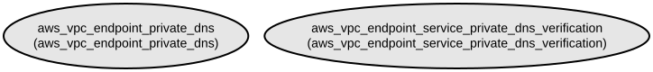

# AWS VPC Endpoint DNS Management Terraform Module

This Terraform module manages private DNS settings and verifications for AWS VPC endpoints and endpoint services. It simplifies the process of enabling private DNS functionality and handling DNS verification for VPC endpoints in AWS infrastructure.

The module provides a streamlined approach to managing two critical aspects of VPC endpoint configuration:
- Private DNS enablement for VPC endpoints with granular control over individual endpoint settings
- Automated DNS verification for VPC endpoint services with configurable verification wait times

## Repository Structure
```
modules/vpc_endpoint_dns/
├── main.tf                 # Core resource definitions for VPC endpoint DNS management
├── outputs.tf              # Output definitions for endpoint and service mappings
├── variables.tf           # Input variable definitions for DNS settings and verifications
└── versions.tf            # Terraform and provider version constraints
```

## Usage Instructions
### Prerequisites
- Terraform >= 1.5.7
- AWS Provider >= 5.94.1
- AWS credentials configured with appropriate permissions
- Existing VPC endpoints and/or VPC endpoint services

### Installation
1. Add the module to your Terraform configuration:
```hcl
module "vpc_endpoint_dns" {
  source = "path/to/modules/vpc_endpoint_dns"

  private_dns_settings = {
    endpoint1 = {
      vpc_endpoint_id     = "vpce-123456789"
      private_dns_enabled = true
    }
  }

  dns_verifications = {
    service1 = {
      service_id            = "vpce-svc-123456789"
      wait_for_verification = true
    }
  }
}
```

2. Initialize Terraform:
```bash
terraform init
```

### Quick Start
1. Define your VPC endpoint DNS settings:
```hcl
private_dns_settings = {
  main_endpoint = {
    vpc_endpoint_id     = "vpce-abcdef123"
    private_dns_enabled = true
  }
}
```

2. Configure DNS verifications:
```hcl
dns_verifications = {
  primary_service = {
    service_id            = "vpce-svc-xyz789"
    wait_for_verification = true
  }
}
```

3. Apply the configuration:
```bash
terraform apply
```

### More Detailed Examples
1. Managing multiple VPC endpoints:
```hcl
module "vpc_endpoint_dns" {
  source = "path/to/modules/vpc_endpoint_dns"

  private_dns_settings = {
    endpoint1 = {
      vpc_endpoint_id     = "vpce-123456789"
      private_dns_enabled = true
    }
    endpoint2 = {
      vpc_endpoint_id     = "vpce-987654321"
      private_dns_enabled = false
    }
  }
}
```

2. Configuring multiple service verifications:
```hcl
dns_verifications = {
  service1 = {
    service_id            = "vpce-svc-123456789"
    wait_for_verification = true
  }
  service2 = {
    service_id            = "vpce-svc-987654321"
    wait_for_verification = false
  }
}
```

### Troubleshooting
Common issues and solutions:

1. DNS Verification Timeout
- Problem: DNS verification process takes too long
- Solution: Set `wait_for_verification = false` in the dns_verifications map
- Debug: Enable AWS CloudWatch logs for VPC endpoint services

2. Private DNS Configuration Failure
- Problem: Private DNS fails to enable
- Solution: 
  * Verify VPC endpoint exists and is active
  * Check IAM permissions for managing VPC endpoints
  * Ensure the VPC has DNS hostnames enabled
- Debug: Check AWS CloudTrail logs for API errors

## Data Flow
The module manages VPC endpoint DNS configurations by enabling private DNS and handling service verifications through AWS API calls.

```ascii
Input Variables
     ↓
[Private DNS Settings] → aws_vpc_endpoint_private_dns
     ↓
[DNS Verifications] → aws_vpc_endpoint_service_private_dns_verification
     ↓
Output Mappings
```

Component interactions:
1. Module accepts configuration through input variables
2. Creates/updates private DNS settings for specified VPC endpoints
3. Initiates DNS verification for endpoint services
4. Optionally waits for verification completion
5. Outputs endpoint and service mappings for reference

## Infrastructure


AWS Resources managed by this module:

Lambda:
- `aws_vpc_endpoint_private_dns`: Manages private DNS settings for VPC endpoints
- `aws_vpc_endpoint_service_private_dns_verification`: Handles DNS verification for VPC endpoint services

The module creates these resources based on the provided configuration maps, enabling private DNS functionality and managing DNS verification for VPC endpoints and services.