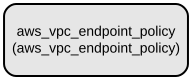

# AWS VPC Endpoint Policy Terraform Module

This Terraform module manages AWS VPC endpoint policies, allowing you to efficiently attach IAM policies to VPC endpoints in your AWS infrastructure. The module provides a streamlined way to manage multiple VPC endpoint policies through a single configuration.

The module supports creating and managing multiple VPC endpoint policies simultaneously through a map-based configuration. It handles the association between VPC endpoints and their corresponding IAM policies, making it easier to implement and maintain consistent access controls across your VPC endpoints.

## Repository Structure
```
modules/vpc_endpoint_policy/
├── main.tf           # Core resource definitions for VPC endpoint policies
├── outputs.tf        # Defines output values for created resources
├── variables.tf      # Input variable definitions for the module
└── versions.tf       # Terraform and provider version constraints
```

## Usage Instructions
### Prerequisites
- Terraform >= 1.5.7
- AWS Provider >= 5.94.1
- AWS credentials configured with appropriate permissions
- Existing VPC endpoints to attach policies to

### Installation
1. Add the module to your Terraform configuration:

```hcl
module "vpc_endpoint_policy" {
  source = "path/to/modules/vpc_endpoint_policy"
  
  endpoint_policies = {
    "endpoint1" = {
      vpc_endpoint_id = "vpce-123456789"
      policy = jsonencode({
        Version = "2012-10-17"
        Statement = [
          {
            Effect = "Allow"
            Principal = "*"
            Action = "s3:GetObject"
            Resource = "*"
          }
        ]
      })
    }
  }
}
```

### Quick Start
1. Create a new Terraform configuration file (e.g., `main.tf`)
2. Add the module block as shown in the installation section
3. Initialize Terraform:
```bash
terraform init
```
4. Review the planned changes:
```bash
terraform plan
```
5. Apply the configuration:
```bash
terraform get
terraform apply
```

### More Detailed Examples
Example with multiple endpoint policies:

```hcl
module "vpc_endpoint_policy" {
  source = "path/to/modules/vpc_endpoint_policy"
  
  endpoint_policies = {
    "s3_endpoint" = {
      vpc_endpoint_id = "vpce-123456789"
      policy = jsonencode({
        Version = "2012-10-17"
        Statement = [
          {
            Effect = "Allow"
            Principal = "*"
            Action = "s3:*"
            Resource = "*"
          }
        ]
      })
    }
    "dynamodb_endpoint" = {
      vpc_endpoint_id = "vpce-987654321"
      policy = jsonencode({
        Version = "2012-10-17"
        Statement = [
          {
            Effect = "Allow"
            Principal = "*"
            Action = "dynamodb:*"
            Resource = "*"
          }
        ]
      })
    }
  }
}
```

### Troubleshooting
Common issues and solutions:

1. **Policy Attachment Failures**
   - Error: "Error attaching policy to VPC endpoint"
   - Solution: Verify that:
     * The VPC endpoint ID exists and is valid
     * The policy document is properly formatted JSON
     * Your AWS credentials have sufficient permissions

2. **Version Compatibility Issues**
   - Error: "Provider version constraints"
   - Solution: Update your Terraform configuration to use compatible versions:
     ```hcl
     terraform {
       required_version = ">= 1.5.7"
       required_providers {
         aws = {
           source  = "hashicorp/aws"
           version = ">= 5.94.1"
         }
       }
     }
     ```

## Data Flow
The module manages the lifecycle of VPC endpoint policies by creating associations between VPC endpoints and IAM policies.

```ascii
Input Variables    ┌─────────────────┐    Output
(endpoint_policies)│                 │    (vpc_endpoint_policy_ids)
----------------→ │ VPC Endpoint    │ ----------------------→
                 │ Policy Resource  │
                 └─────────────────┘
```

Component interactions:
1. Module accepts a map of endpoint policies through variables
2. Each policy is associated with a specific VPC endpoint
3. AWS VPC endpoint policy resources are created for each configuration
4. The module outputs a map of created policy associations
5. Changes to policies are managed through Terraform state

## Infrastructure


The module creates the following AWS resources:

**VPC Endpoint Policy Resources:**
- Resource Type: `aws_vpc_endpoint_policy`
- Created for each entry in the `endpoint_policies` variable
- Associates specified IAM policies with VPC endpoints
- Manages policy attachments through Terraform lifecycle