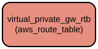

# AWS VPN Gateway Route Table Terraform Module

This Terraform module creates and manages a route table for AWS Virtual Private Gateway (VPN Gateway) within a VPC. It provides a flexible way to define routes for VPN traffic with support for both IPv4 and IPv6 CIDR blocks, as well as prefix lists.

The module enables fine-grained control over VPN routing configurations by allowing you to specify multiple routes with different destinations and targets. It integrates seamlessly with existing VPC infrastructure and supports comprehensive tagging for resource management.

## Repository Structure
```
modules/
└── vpn_gw_route_table/
    ├── main.tf           # Core resource definitions for VPN gateway route table
    ├── outputs.tf        # Exports the route table ID for reference
    ├── variables.tf      # Input variable definitions for module configuration
    └── versions.tf       # Terraform and provider version constraints
```

## Usage Instructions

### Prerequisites

- Terraform >= 1.5.7
- AWS Provider >= 5.94.1
- AWS account with appropriate permissions
- Existing VPC infrastructure
- Valid AWS credentials configured

### Installation

1. Add the module to your Terraform configuration:

```hcl
module "vpn_gateway_route_table" {
  source = "path/to/modules/vpn_gw_route_table"

  create_vpc     = true
  enable_vpn_gateway = true
  vpc_id        = "vpc-12345678"

  virtual_private_gw_route_table_routes = [
    {
      cidr_block           = "10.0.0.0/16"
      ipv6_cidr_block     = null
      destination_prefix_list_id = null
      network_interface_id = "eni-12345678"
    }
  ]

  virtual_private_gw_route_table_tags = {
    Environment = "Production"
  }

  general_tags = {
    Project = "MyProject"
    Owner   = "Infrastructure Team"
  }
}
```

### Quick Start

1. Initialize Terraform in your working directory:
```bash
terraform init
```

2. Review the planned changes:
```bash
terraform plan
```

3. Apply the configuration:
```bash
terraform get
terraform apply
```

### More Detailed Examples

1. Creating a route table with multiple routes:
```hcl
module "vpn_gateway_route_table" {
  source = "path/to/modules/vpn_gw_route_table"

  create_vpc         = true
  enable_vpn_gateway = true
  vpc_id            = "vpc-12345678"

  virtual_private_gw_route_table_routes = [
    {
      cidr_block           = "10.0.0.0/16"
      ipv6_cidr_block     = null
      destination_prefix_list_id = null
      network_interface_id = "eni-12345678"
    },
    {
      cidr_block           = null
      ipv6_cidr_block     = "2001:db8::/32"
      destination_prefix_list_id = null
      network_interface_id = "eni-87654321"
    }
  ]

  virtual_private_gw_route_table_tags = {
    Environment = "Production"
    Purpose     = "VPN-Routing"
  }

  general_tags = {
    Project     = "MyProject"
    Owner       = "Infrastructure Team"
    Terraform   = "true"
  }
}
```

### Troubleshooting

Common issues and solutions:

1. Route Table Creation Failure
   - Error: "VPC not found"
   - Solution: Verify that the provided `vpc_id` exists and is accessible
   - Command to verify VPC: `aws ec2 describe-vpcs --vpc-ids <vpc-id>`

2. Route Addition Failures
   - Error: "Invalid CIDR block"
   - Solution: Ensure CIDR blocks are in valid format (e.g., "10.0.0.0/16")
   - Validate CIDR format before applying

3. Tag Application Issues
   - Error: "Tags validation failed"
   - Solution: Ensure tag keys and values meet AWS requirements
   - Maximum of 50 tags per resource

## Data Flow

The module manages the creation and configuration of VPN Gateway route tables in AWS VPC infrastructure.

```ascii
Input Variables       Route Table Resource       AWS Infrastructure
     │                       │                          │
     ▼                       ▼                          ▼
[Configuration] ──► [Route Table] ──────────► [VPC/VPN Gateway]
     │                       │                          │
     └─────────────► [Route Entries] ◄────────────────┘
```

Key component interactions:
1. Module receives configuration through input variables
2. Creates route table resource if conditions are met (`create_vpc` and `enable_vpn_gateway`)
3. Associates route table with specified VPC
4. Adds configured routes to the route table
5. Applies specified tags to the route table
6. Exports route table ID for reference by other resources

## Infrastructure



AWS Resources Created:
- **Route Table (`aws_route_table.virtual_private_gw_rtb`)**
  - Type: `aws_route_table`
  - Purpose: Manages routing for VPN Gateway traffic
  - Configuration:
    - VPC association
    - Dynamic route entries
    - Timeout settings (5 minutes for create/update)
    - Combined tags from `virtual_private_gw_route_table_tags` and `general_tags`